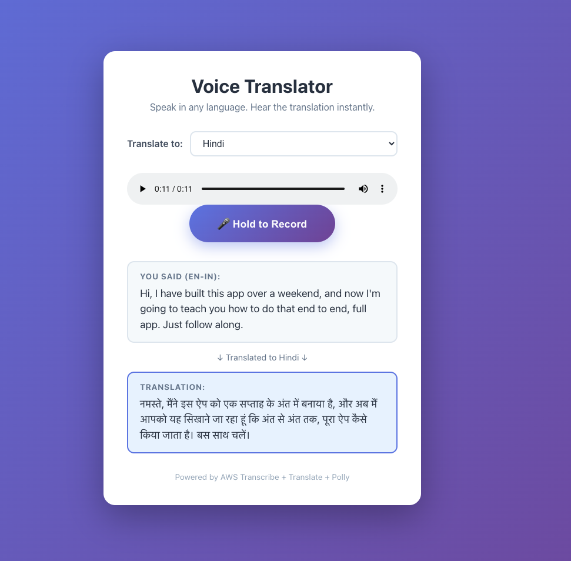

<div align="center">

  <!-- Replace with your actual screenshot or logo -->
  

  <h1>🎤 Voice Translator</h1>

  <p>
    <strong>Speak in any language. Hear the translation instantly.</strong><br/>
    A real-time voice translator built with AWS AI services and React.<br/>
    Built in a single weekend as part of the
    <a href="https://youtu.be/s2cbHwGTIbA">Build Over A Weekend</a>
    YouTube series.
  </p>

  <!-- Badges -->
  
  
  
  
  

  [**▶ Watch the Tutorial**](https://youtu.be/s2cbHwGTIbA) ·
  [**🚀 Live Demo**](https://buildoveraweekend.github.io/voice-translator) ·
  [**📖 Setup Guide**](#-setup)

</div>

---

## 🎬 Tutorial 

[▶ Watch](https://youtu.be/s2cbHwGTIbA) 

---

## 🗓 Weekend Timeline

| Day | What We Built |
|-----|--------------|
| **Saturday AM** | AWS account setup · IAM user · S3 bucket · Lambda role |
| **Saturday PM** | Lambda function · Transcribe pipeline · Translate · Polly |
| **Saturday Eve** | API Gateway · CORS config · curl testing |
| **Sunday AM** | React app · Language picker · MediaRecorder API |
| **Sunday PM** | Audio playback · useEffect fix · stale closure bug |
| **Sunday Eve** | GitHub Actions · GitHub Pages deploy · Live! 🎉 |

---

## 🏗 Architecture

```
Browser → API Gateway → Lambda → S3 (audio)
                              → Amazon Transcribe (speech→text)
                              → Amazon Translate (text→text)
                              → Amazon Polly (text→speech)
                              → Browser (plays audio)
```

**AWS Services used (all Free Tier):**

| Service | Purpose | Free Tier |
|---------|---------|-----------|
| API Gateway | REST API endpoint | 1M calls/month |
| AWS Lambda | Python orchestrator | 1M calls/month |
| Amazon S3 | Audio file storage | 5GB |
| Amazon Transcribe | Speech to text | 60 mins/month |
| Amazon Translate | Text translation | 2M chars/month |
| Amazon Polly | Text to speech | 5M chars/month |
| CloudWatch | Logging & monitoring | 5GB logs/month |

---

## ✅ Prerequisites

Before you start, make sure you have:

- [ ] [Node.js 18+](https://nodejs.org/) installed
- [ ] [Python 3.11+](https://python.org/) installed
- [ ] [AWS CLI](https://aws.amazon.com/cli/) installed and configured
- [ ] [Git](https://git-scm.com/) installed
- [ ] An [AWS account](https://aws.amazon.com/free/) (free)
- [ ] A [GitHub account](https://github.com/) (free)

---
## 🌿 Branches

| Branch | Description |
|--------|-------------|
| `main` | Finished, working app — clone this to see the final result |
| `starter-code` | Start here if following the tutorial — has TODO comments |

## ⚠️ Before You Start — Personalise These Values

S3 bucket names must be **globally unique** across all AWS accounts 
worldwide. You must choose your own unique name before deploying.

Find and replace `voice-translator-YOUR-NAME-2026` with your own 
bucket name in these files:

| File | What to change |
|------|---------------|
| `backend/iam-policy.json` | The S3 Resource ARN |
| `.env` | The BUCKET_NAME value |
| `backend/lambda_function.py` | The BUCKET_NAME value |

**Good bucket name examples:**
- `voice-translator-boaw-2026`
- `voice-translator-john-smith-2026`

**Rules for bucket names:**
- Lowercase letters, numbers, and hyphens only
- No spaces, no uppercase, no underscores
- Between 3 and 63 characters
- Must be unique globally — if it's taken, add more to it

## 🚀 Setup

### Option A — Follow Along (Recommended for learners)

Switch to the `starter-code` branch and build it with us:

```bash
git checkout starter-code
```

The starter branch has the folder structure and empty functions
with `# TODO` comments — perfect for coding along with the videos.

### Option B — Run the Finished App

**1. Clone the repo**
```bash
git clone https://github.com/buildoveraweekend/voice-translator.git
cd voice-translator
```

**2. Set up environment variables**
```bash
cp frontend/.env.example frontend/.env
# Open .env and fill in your API Gateway URL. .env file is not committed to your github repo because it is ignored by .gitignore. Github deployment will pick up API URL throgh Github Secrets. .env is refered on only on your local. 
```s

**3. Deploy the backend**
```bash
cd backend
zip function.zip lambda_function.py

aws lambda create-function \
  --function-name voice-translator \
  --runtime python3.11 \
  --role arn:aws:iam::YOUR-ACCOUNT-ID:role/voice-translator-lambda-role \
  --handler lambda_function.lambda_handler \
  --zip-file fileb://function.zip \
  --timeout 90 \
  --memory-size 256 \
  --region eu-west-2
```

> 🔐 **Permissions help**: See [`backend/iam-policy.json`](backend/iam-policy.json)
> for the exact IAM policy your Lambda role needs.
> Watch [Part 2 at 9:00](https://youtu.be/PART2-LINK?t=540) for
> a walkthrough of the IAM setup.

**4. Set up the frontend**
```bash
cd frontend
npm install
npm start
```

**5. Deploy to GitHub Pages**
```bash
npm run deploy
```

---

## 📁 Project Structure

```
voice-translator/
├── .github/
│   └── workflows/
│       └── deploy.yml      ← Auto-deploys frontend on push to main
├── backend/
│   ├── lambda_function.py  ← The translation pipeline
│   ├── requirements.txt    ← Python dependencies
│   └── iam-policy.json     ← IAM policy template for Lambda role
├── frontend/
│   ├── src/
│   │   ├── App.js          ← Main React component
│   │   ├── App.css         ← Styles
│   │   └── config.js       ← API URL and language config
│   └── package.json
├── .env.example            ← Environment variable template
├── .gitignore
└── README.md
```

---

## 🐛 Common Issues

**"Failed to fetch" in the browser**
→ CORS headers missing from Lambda response. Every response —
including errors — must include `Access-Control-Allow-Origin: *`.
Check CloudWatch logs for the real error.
[Watch the fix at Part 3, 20:00](https://youtu.be/PART3-LINK?t=1200)

**App always translates to Spanish**
→ Stale closure bug in React. `targetLang` state is captured at
initial value inside `useCallback`. Fix: use a `useRef` to track
the current language.
[Watch the fix at Part 3, 15:00](https://youtu.be/PART3-LINK?t=900)

**Audio doesn't play**
→ The `<audio>` element must always be in the DOM — not inside a
conditional render block. Use `display: none` via CSS instead.
[Watch the fix at Part 3, 24:00](https://youtu.be/PART3-LINK?t=1440)

**Transcription job fails**
→ Check the S3 bucket name matches the Lambda environment variable.
Check CloudWatch: Lambda → Monitor → View CloudWatch logs.

---

## 💸 Cost

**This project costs £0.00** when built following this tutorial.
All services used are within the AWS Free Tier.

| Service | Free limit | This project uses |
|---------|-----------|------------------|
| Lambda | 1M req/month | ~500 during dev |
| API Gateway | 1M calls/month | ~500 during dev |
| Transcribe | 60 min/month | ~15 min |
| Translate | 2M chars/month | ~5,000 chars |
| Polly | 5M chars/month | ~5,000 chars |
| S3 | 5GB | < 1MB |

> ⚠️ Set up a [billing alert](https://console.aws.amazon.com/billing)
> before you start. You'll get an email if any charge occurs.

---

## 📺 Build Over A Weekend

This project is part of the **Build Over A Weekend** YouTube series —
where parents and kids build real, working technology projects together.

**From screen time to build time — skills for life.**

[▶ Subscribe on YouTube](https://youtube.com/@BuildOverAWeekend)

---

## 📄 Licence

MIT — use this code however you like.
```

---
